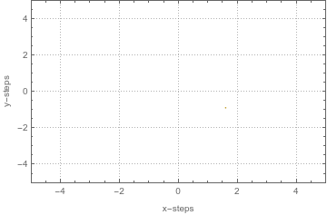

# Two Dimentional Random Walk

## Abstract
The goal of this experiment was to find the most probable distance travelled 
using a random walk. Our random walk selected each step from a Gaussian 
distribution in the $x$ and $y$ direction. After the number of steps were set 
to $1000$ and the total number of runs as well as the standard deviation in the 
size of the steps was altered. The most probable distance over standard 
deviation in step size was then calculated. It was found that the average 
distance travelled was $\sigma\sqrt{n}$ (with $\sigma$ being the standard 
deviation in the step size and n being the number of steps taken).  
This is in close agreement with theoretical predictions.

```
Export[FileNameJoin[{NotebookDirectory[], "randomWalk.gif"}], 
  randWalkList[{0.15, 0.15}, {0, 0}, 250]];
```



## Graphically Display Random Walks
The first part of our code shows a small sample of our random walks. We wanted 
to visualize what our walk was doing so we allow the code to display $10$ random 
walks. The Orange point represents the starting point and the purple point is 
the ending point.  The blue line connecting them is the distance that we are 
measuring in our experiment.

```
Export[FileNameJoin[{NotebookDirectory[], "randomWalkList.gif"}], 
  Table[rndWlkDistancePlot[{0.15, 0.15}, {0, 0}, 1000, 0.75], {10}],
  DisplayDurations -> 1, AnimationRepititions -> \[Infinity]];
```


## Testing Fitting Function
For the second part of the graph we wanted to test our fitting function and see 
the desired number of runs in order to find the proper statistics. We ran the 
random walks with an increasing amount of runs from $500$-$250,000$ with the 
number of steps fixed at $1,000$. We then fit the function with a hyperbolic 
distribution in order to find the approximate maximum.  As can be seen by our 
figure we get a smoother function as we increase the number of runs.


## Finding Final Distance From the Origin
In the next step of our experiment we adjusted the standard deviation in our 
experiment. The standard deviations were set at 1.00, 0.025, 0.15, and 0.05 and 
the number of runs were set at $5000$ with $1000$ steps in each run. The peaks 
were calculated using the function in the previous part. All of our 
distributions were in close agreement with theory.


## Finding the most probable distance
In this part of the experiment the best fit from $70$ different walks was taken. 
The stepsize was allowed to vary from $5$-$3500$ steps. A curve was then fit 
to the data, which found the distance traveled to increase with the square 
root of number of steps.


## Conclustion
In conclusion our random walk shows close agreement with theory. This 
simulation shows that contrary to conventional thinking a random walk will most 
likely not lead you back to he origin. So if you are looking for your drunk 
friend after a night of heavy drinking, he is probably $\sigma\sqrt{n}$ steps 
away from where you left him.

